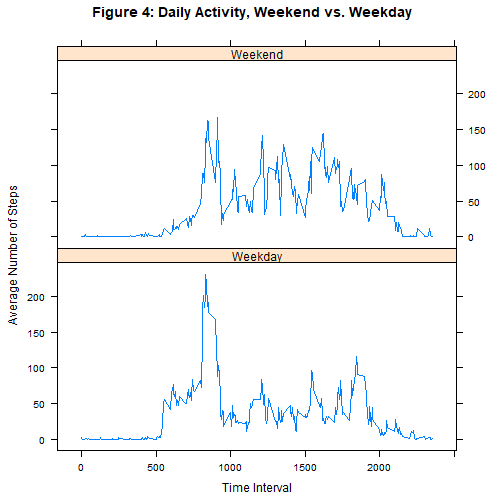

### Loading and preprocessing the data


```r
## Set working directory

mywd <- "C:/Users/SAR/Documents/Reproducible Research/Course Project 1"
setwd(mywd)

## Download the data
dataFileURL <- "https://d396qusza40orc.cloudfront.net/repdata%2Fdata%2Factivity.zip"
download.file(dataFileURL, "./data.zip")
unzip("./data.zip")

## Read in the data
activity_raw <- read.csv("./activity.csv", header = TRUE)
activity_raw$date <- as.Date(activity_raw$date)
```


### Part 1: What is mean total number of steps taken per day?


```r
## Code chunk for Part 1 - Go back and make it look nicer later
totalSteps <- aggregate(activity_raw$steps, list(Group.date = activity_raw$date), FUN = sum)

## Make a histogram of the total number of steps taken each day. Calculate and report the mean and
## median of the total number of steps taken per day.

hist(totalSteps$x, main = "Figure 1: Histogram of Total Daily Steps", xlab = "Total Daily Steps")
```


```r
## Still have not removed NAs from data, so will need to do so for mean/median
mean(totalSteps$x, na.rm = TRUE)
```

```
## [1] 10766.19
```

```r
median(totalSteps$x, na.rm = TRUE)
```

```
## [1] 10765
```


### Part 2: What is the average daily activity pattern?


```r
## Code chunk for Part 2 - remove RM from data set first
ar_part2 <- subset(activity_raw, is.na(steps) == FALSE)

## Calculate and plot mean steps as a time-series
meanStepsByInterval <- aggregate(ar_part2$steps, list(Group.interval = ar_part2$interval), FUN = mean)
plot(meanStepsByInterval$Group.interval, meanStepsByInterval$x, type = "l", main = "Figure 2: Average Steps by Time Interval", xlab = "Time Interval", ylab = "Average Number of Steps" )
```


```r
## Now which 5-minute interval contains the most steps on average?

meanStepsByInterval[(which.max(meanStepsByInterval$x)), 1]
```

```
## [1] 835
```


### Part 3: Imputing missing values.


```r
## Start by creating a duplicate copy of raw data set
ar_imputed <- activity_raw

## Calculate and report the total number of missing values in the dataset (i.e. the total number of rows with NAs).

nrow(ar_imputed[is.na(ar_imputed$steps), ])
```

```
## [1] 2304
```

```r
## Data imputation - go through and set NAs to previously calculated means

for (i in 1:nrow(ar_imputed))
     {
       
       if (is.na(ar_imputed[i, 1]))
           {
             
             this_interval <- ar_imputed[i,3]
             ar_imputed[i,1] <- meanStepsByInterval[meanStepsByInterval$Group.interval == this_interval, 2]
             
          
           }
       
}

## Make a histogram of the total number of steps taken each day and Calculate and report the mean
## and median total number of steps taken per day. Do these values differ from the estimates from
## the first part of the assignment? What is the impact of imputing missing data on the estimates of
## the total daily number of steps?

totalStepsImputed <- aggregate(ar_imputed$steps, list(Group.date = ar_imputed$date), FUN = sum)
hist(totalStepsImputed$x, main = "Figure 3: Histogram of Total Daily Steps (Imputed Data)", xlab = "Total Daily Steps")
```


```r
## Report median and mean from imputed data set - by now should not have any NAs left

mean(totalStepsImputed$x, na.rm = FALSE)
```

```
## [1] 10766.19
```

```r
median(totalStepsImputed$x, na.rm = FALSE)
```

```
## [1] 10766.19
```

### Part 4: Are there differences in activity patterns between weekdays and weekends?


```r
## Create a new factor variable in the dataset with two levels – “weekday” and “weekend”
## indicating whether a given date is a weekday or weekend day. For this part 
## the weekdays() function may be of some help here.

ar_imputed$weekday <- weekdays(ar_imputed$date)
ar_imputed$weekday[ar_imputed$weekday %in% c("Monday", "Tuesday", "Wednesday", "Thursday", "Friday")] <- "Weekday"
ar_imputed$weekday[ar_imputed$weekday %in% c("Saturday", "Sunday")] <- "Weekend"
ar_imputed$weekday <- as.factor(ar_imputed$weekday)

## Use "formula method" of aggregate to get mean # of steps by
## interval and weekday

meanStepsInt_Imputed <- aggregate(.~interval + weekday, ar_imputed, mean)

## Make a panel plot containing a time series plot (i.e. type = "l")
## of the 5-minute interval (x-axis) and the average number of steps taken, 
## averaged across all weekday days or weekend days (y-axis). 

library(lattice)
p <- xyplot(steps ~ interval | weekday, data = meanStepsInt_Imputed, type = "l", layout = c(1,2), main = "Figure 4: Daily Activity, Weekend vs. Weekday", xlab = "Time Interval", ylab = "Average Number of Steps")
print(p)
```


